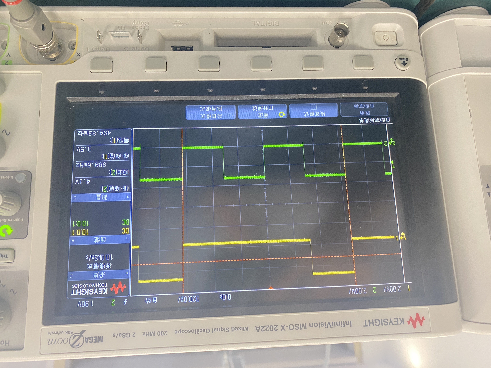

# VE373 Lab 2

> Group 5: Qian Dong :butterfly: , Yifan Hu:one: , Yinchen Ni:hamster:

### Target of this Lab

> From Lab Manuel

To develop an embedded program that can output two pulse train signals on the board, one with **25% duty cycle** and **0.5 Hz** frequency, and the other with **50% duty cycle and 1Hz**.  We will use the **LED twinkle** to represent the pulse signal. Then program one of the push buttons to stop the LED.

### Source Code

```C
#include <p32xxxx.h>
#define DELAY 14000  // 0.5 s

main() {
	// initialization
    DDPCONbits.JTAGEN = 0; //disable JTAGport, free up PORTA
    TRISD = 0xfff0; //configure inputs and outputs
    PORTD = 0; //clear PORTD

    while(1) {
        LATDbits.LATD0 = 1; //flash LEDs
        LATDbits.LATD1 = 1;
        delay_half_sec(1);

        LATDbits.LATD0 = 0;
        LATDbits.LATD1 = 0;
        delay_half_sec(1);
        LATDbits.LATD0 = 0;
        LATDbits.LATD1 = 1;
        delay_half_sec(1);
        LATDbits.LATD0 = 0;
        LATDbits.LATD1 = 0;
        delay_half_sec(1);
        if (PORTDbits.RD6==0) { //if SWl pressed
            delay_half_sec(3); //debounce
            if (PORTDbits.RD6==0) while(1); //trap
        } 
    }
}

delay_half_sec(int number) {
    int i;
    for (i=0; i < DELAY*number; i++);
}

```

#### Key Notes

1. Use `LATDbits.LATD0 = 1` and `LATD1` to control `LED0` and `LED1` respectively
2. `delay_half_sec()` generates the delay by running empty for loops, which waste computation resources and should be improved in the future

### Experiment Outcomes

#### Methodology

To make the LED frequency changed to 1Hz,  we adjusted the value of  `DELAY` and we use an oscilloscope to help us determine the exact frequency.



#### Result Analysis

+ As from the above figure, the frequency of the second (green) wave is `989.6mHz`, and another wave is `494.83mHz`, which is close to our goal `0.5Hz` and `1Hz`.
+ Also we can inspect from the figure, the yellow wave has approximately a duty cycle of 25%, while the green wave's duty cycle is 50%.
+ The value of `DELAY` still need to be adjusted tiny bit to reach the ideal frequency. However, since we used for loop to generate the delay, it's hard to reach high accuracy. Instead, other methods like interrupts should be adopted.

### 