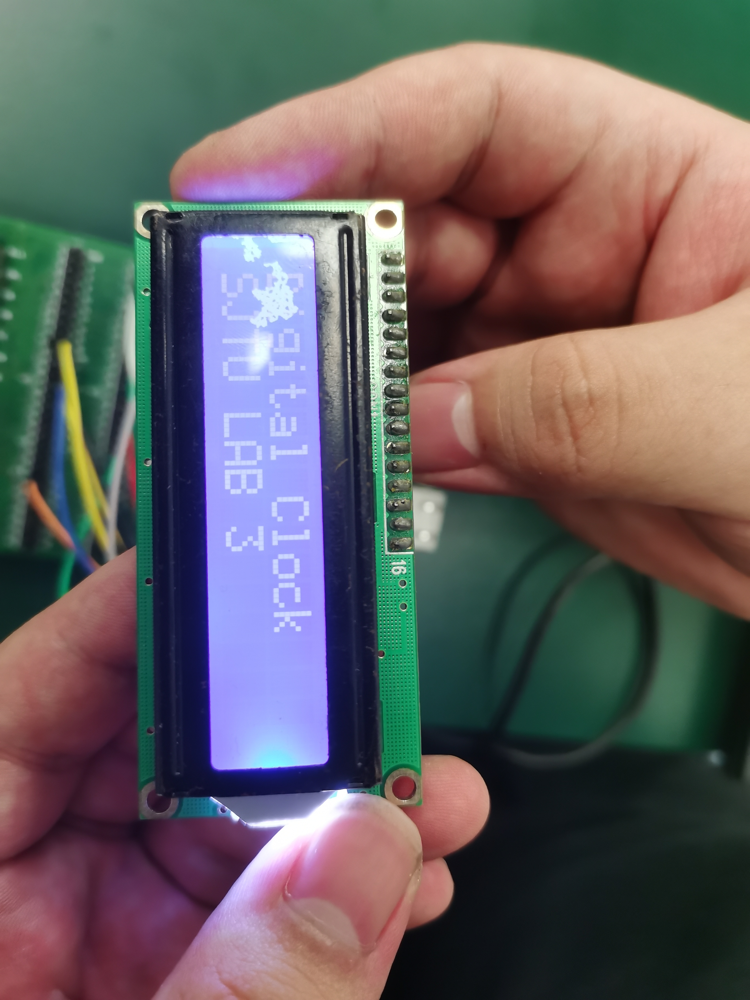
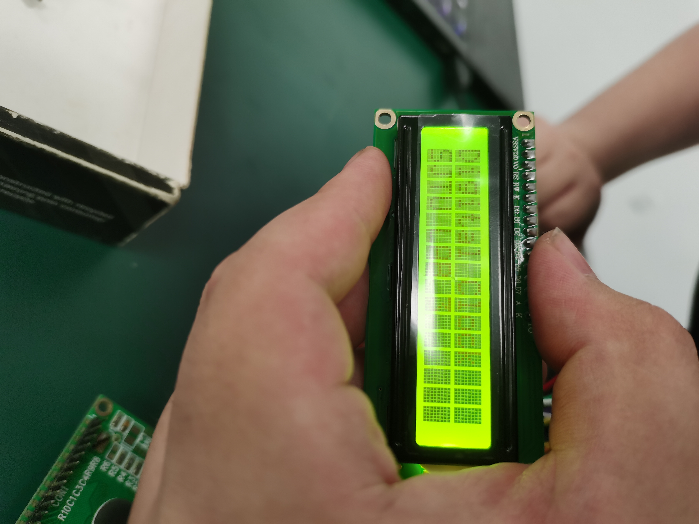

# VE373 Lab 3

> Group 5: Qian Dong :butterfly: , Yifan Hu:one: , Yinchen Ni:hamster:

### Target of this Lab

> From Lab Manuel

To develop an embedded program that can control the LCD screen 1602A and display two lines of words. We used timer interrupt to control the time precisely for putting the words.

### Source Code

`LCD.h`

```C
/************************************************************************
* LCD.h
* Header file for the LCD Driver
************************************************************************/
#include <p32xxxx.h>

/* define macros for LCD instructions */
#define LCD_IDLE 0x33
#define LCD_2_LINE_4_BITS 0x28
#define LCD_2_LINE_8_BITS 0x38
#define LCD_DSP_CSR 0x0c 
#define LCD_CLR_DSP 0x01
#define LCD_CSR_INC 0x06
#define LCD_SFT_MOV 0x14

// * define macros for interfacing ports
#define RS      PORTDbits.RD0
#define E       PORTDbits.RD1
#define Data    PORTE

typedef unsigned char uchar;

struct bits {
    unsigned timer1_done : 1;
//    ...other user defined flags may go here
} flags;

// * define constant strings for display */
const uchar startStr1[] = "Digital Clock";
const uchar startStr2[] = "SJTU LAB 3";

/* Function prototypes */
void MCU_init(void);
void LCD_init(void);
void LCD_putchar(uchar c);
void LCD_puts(const uchar *s, int length);
void LCD_goto(uchar addr);
void GenMsec(void);
void DelayUsec(uchar num);
void DelayMsec(uchar num);

/*****************end of LCD.h**********************/

```

`LCD.c`

```C
/************************************************************************
* LCD.c
************************************************************************/
#include "LCD.h"

/* main driver */
int main() {
    SYSKEY = 0x0;               // Ensure OSCCON is locked
    SYSKEY = 0xAA996655;        // Write Key1 to SYSKEY
    SYSKEY = 0x556699AA;        // Write Key2 to SYSKEY
    OSCCONbits.PBDIV = 0b00;    // Configure OSCCON.PBDIV to 1:1
    SYSKEY = 0x0;               // Lock OSCCON

    MCU_init();
    LCD_init();
    RS = 1;
    int if_llss = 0;
    while(1){
        RS = 0;
        LCD_goto(0x00);
        RS = 1;
        LCD_puts(startStr1,13);
        RS = 0;
        LCD_goto(0x40);
        RS = 1;
        LCD_puts(startStr2,10);

        DelayMsec(500);
        RS = 0;
        LCD_putchar(0x01); // clear
        LCD_goto(0x0);
        RS = 1;
        DelayMsec(1);
    }
}

/* initialize the PIC32 MCU */
void MCU_init() {
    /* setup I/O ports to connect to the LCD module */
    // let A,B,D,E all to be output
    TRISDCLR = 0xFFFF;
    TRISECLR = 0xFFFF;
    TRISACLR = 0xFFFF;
    TRISBCLR = 0xFFFF;

    /* setup Timer to count for 1 us and 1 ms */
    // ...your code goes here
    SYSKEY = 0x0;               // Ensure OSCCON is lock
    SYSKEY = 0xAA996655;        // Unlock sequence part 1 of 2 back to back instructions.
    SYSKEY = 0x556699AA;        // Unlock sequence part 2 of 2 back to back instructions.
    OSCCONbits.NOSC = 0x0007;   // Write new osc src value to NOSC control bits -- FRS, with original freqeuncy as 8 MHz
    OSCCONbits.FRCDIV = 0x3; // the prescale of FRC is 8
    OSCCONbits.PBDIV = 0x0;    // PBCLK is SYSCLK divided by 1. {(Not changed here)Clock is multiplied by 15. PLL output is divided by 1} -- PBCLK has freqeuncy 1 MHz
    OSCCONbits.OSWEN = 0x0001;  // Initiate clock switch by setting OSWEN bit.
    SYSKEY = 0x0;               // Write non-key value to perform a re-lock.

    while(OSCCONbits.OSWEN);    // Loop until OSWEN = 0. Value of 0 indicates osc switch is complete.

    T1CON = 0x0;
    PR1 = 0xFFFF;
    T1CONSET = 0x8000;
    

    /* Configure Timer interrupts */ 
    INTCONbits.MVEC = 1;        // multi-vector mode
    IPC1SET = 0x000d;           // timer 1: priority is 3, subpriority is 1
    // IPC2SET = 0x000d;           // timer 2: priority is 3, subpriority is 1
    IFS0CLR = 0x0110;           // clear the flags for timer 1 and timer 2
    
    /* enable global and individual interrupts */
    asm( "ei" );                // enable interrupt globally
    IEC0SET = 0x0110;           // enable interrupt for timer 1 and timer 2
}

/* initialize the LCD module */
void LCD_init() {
    DelayMsec(16);      //wait for 16 ms(over 15ms)
    RS = 0;             //send command
    E = 1;
    Data = LCD_IDLE;    //function set - 8 bit interface
    E = 0;
    DelayMsec(5);       //wait for 5 ms
    E = 1;
    Data = LCD_IDLE;    //function set - 8 bit interface
    E = 0;
    DelayUsec(200);     //wait for 200 us(over 100us)
    E = 1;
    Data = LCD_IDLE;    //function set
    E = 0;
    DelayMsec(5);
    E = 1;
    Data = 0b00100000; //function set - 4 bit interface
    E = 0;
    LCD_putchar(LCD_2_LINE_4_BITS);
    DelayMsec(100);
    LCD_putchar(LCD_DSP_CSR);
    DelayUsec(40);
    LCD_putchar(LCD_CLR_DSP);
    DelayMsec(5);
    LCD_putchar(LCD_CSR_INC);
}

/* Send one byte c (instruction or data) to the LCD */
void LCD_putchar(uchar c) {
    E = 1;
    Data = c;   //sending higher nibble
    E = 0;      //producing falling edge on E
    E = 1;
    Data <<= 4; //sending lower nibble through higher 4 ports
    E = 0;      //producing falling edge on E
}

/* Display a string of characters *s by continuously calling LCD_putchar() */
void LCD_puts(const uchar *s, int length) {
    // ...your code goes here
    // ...NOTE: must wait for at least 40 us after sending each character to
        // the LCD module.
    RS = 1;
    int i;
    for (i = 0; i < length; i++) {
        LCD_putchar(s[i]);
        DelayMsec(30);
    }
    RS = 0;
}

/* go to a specific DDRAM address addr */
void LCD_goto(uchar addr) {
    // ...send an address to the LCD
    // ...NOTE: must wait for at least 40 us after the address is sent
    // TODO;
    RS = 0;
    E = 1; Data = 0x80 + addr; E = 0;
    E = 1; Data <<=4;          E = 0;
    DelayUsec(40);
}

/* configure timer SFRs to generate num us delay*/
void DelayUsec(uchar num) {
    // ...your code goes here
    PR1 = num;
    flags.timer1_done = 0;
    T1CONSET = 0x8000;              // turn on the timer 1
    TMR1 = 0x0;                     // reset the timer 1
    while ( ! flags.timer1_done );  // loop until flag 04 (for timer 1) is set
    flags.timer1_done = 0;          // reset the flags
    T1CONCLR = 0x8000;                    // turn off timer 
}

/* configure timer SFRs to generate 1 ms delay*/
void GenMsec() {
    // ...your code goes here
    DelayUsec(250);
    DelayUsec(250);
    DelayUsec(250);
    DelayUsec(250);
}

/* Call GenMsec() num times to generate num ms delay*/
void DelayMsec(uchar num) {
    uchar i;
    for (i=0; i<num; i++) {
        GenMsec();
    }
}

/* timer 1 interrupt handler */ 
#pragma interrupt timer_1_interrupt ipl3 vector 4
void timer_1_interrupt(void) {
    T1CONCLR = 0x8000;                // turn off the timer 1
    IFS0CLR = 0x0010;           // clear the flag for timer 1
    flags.timer1_done = 1;      // set up the flags
    TMR1 = 0;
}

/*************end of LCD.c**************/

```


#### Key Notes

1. Use `OSCCONbits` to set up the clock source, peripheral clock divider, need to enter `SYSKEY` before the change.
2. `DelayUsec` generates 1us of time delay precisely (compare to the loop in previous lab) by using interrupts.
3. The LCD is controlled by `RS` bit, when `RS=1`, data is sent; when `RS=1`, command is sent (e.g. goto or clear).
4. Use `TRISDCLR = 0xFFFF;` to set the `PORTD` to be output mode, and in the header file use `#define RS      PORTDbits.RD0` to assign `RS` to a particular bit.

### Experiment Outcomes

Using different LCDs:





#### Result Analysis

+ As shown from the above two figures, the strings are displayed successfully. However, the first one looks better. The port `V0` is connected to GND in our experiment. To improve the display, we can adjust its value to change the contrast.