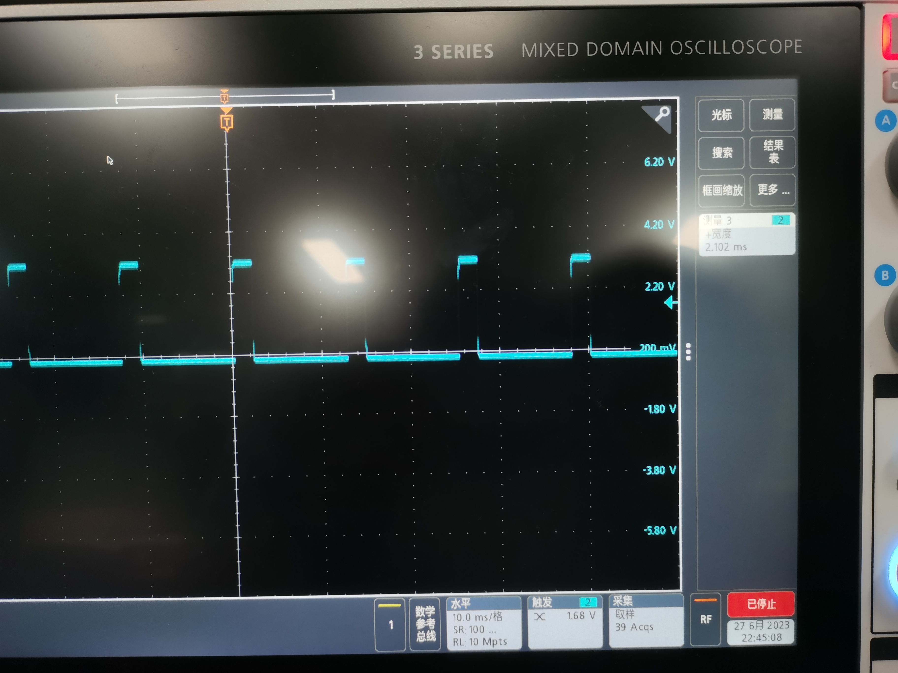
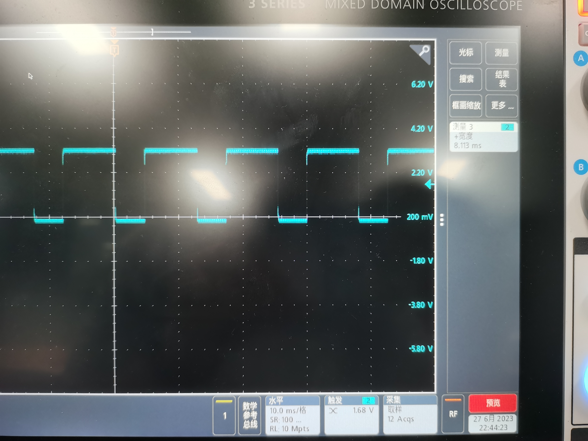

# VE373 Lab 4

> Group 5: Qian Dong :butterfly: , Yifan Hu:one: , Yinchen Ni:hamster:, Jeffery Ma :horse:

### Target of this Lab

> From Lab Manuel

To develop an embedded program that generate a PWM signal to flash an LED

### Source Code

```C
/*********************************************************
 * Lab4.c
 *********************************************************/
#include <p32xxxx.h>

/* Global variables */
unsigned int readD;
int acc = 4000;
const int dec = -4000; //acc determines the acceleration rate
const int inc = 4000;


#pragma interrupt T2_ISR ipl6 vector 8
#pragma interrupt CN_ISR ipl7 vector 26
void T2_ISR (void) {
	T1CONCLR = 0x8000;
	IFS0CLR = 0x00000100;
	TMR2 = 0;
}
void CN_ISR (void) {
	static int pwm = 0;
	IEC1bits.CNIE = 0;
	if (readD == 1) {
		if (pwm == 20000) acc = dec;
		if (pwm == 0 ) acc = inc;
		pwm += acc;
		OC3RS = pwm; //update duty cycle register
	}

	int n = 0;
	while (n < 20000) n++;

	IFS1bits.CNIF = 0;
	IEC1bits.CNIE = 1;
}

void CN_init(void){
	asm("di");
	CNCON = 0x8000;
	CNENbits.CNEN19 = 1; //CN19/RD13 as input
	CNPUEbits.CNPUE19 = 1;
	readD = PORTDbits.RD13;
	IPC6SET = 0x00140000; //Set priority level = 5
	IPC6SET = 0x00030000; //Set subpriority level = 3
	IFS1CLR = 0x0001; //Clear interrupt flag
	IEC1SET = 0x0001;
	asm("ei");
}

void MCU_init(void) {

    SYSKEY = 0x0;               // Ensure OSCCON is locked
    SYSKEY = 0xAA996655;        // Write Key1 to SYSKEY
    SYSKEY = 0x556699AA;        // Write Key2 to SYSKEY
    OSCCONbits.PBDIV = 0b00;    // Configure OSCCON.PBDIV to 1:1
    SYSKEY = 0x0;               // Lock OSCCON

    /* setup I/O ports to connect to the LCD module */
    TRISD = 0xFFF0;

    /* setup Timer to count for 1 us and 1 ms */
    // ...your code goes here
    SYSKEY = 0x0;               // Ensure OSCCON is lock
    SYSKEY = 0xAA996655;        // Unlock sequence part 1 of 2 back to back instructions.
    SYSKEY = 0x556699AA;        // Unlock sequence part 2 of 2 back to back instructions.
    OSCCONbits.NOSC = 0x0007;   // Write new osc src value to NOSC control bits -- FRS, with original freqeuncy as 8 MHz
    OSCCONbits.FRCDIV = 0x2; // the prescale of FRC is 4
    OSCCONbits.PBDIV = 0x0;    // PBCLK is SYSCLK divided by 1. {(Not changed here)Clock is multiplied by 15. PLL output is divided by 1} -- PBCLK has freqeuncy 1 MHz
    OSCCONbits.OSWEN = 0x0001;  // Initiate clock switch by setting OSWEN bit.
    SYSKEY = 0x0;               // Write non-key value to perform a re-lock.

    while(OSCCONbits.OSWEN);    // Loop until OSWEN = 0. Value of 0 indicates osc switch is complete.

	INTCONbits.MVEC = 1; // Enable multiple vector interrupt
    LATDbits.LATD0 = 1;
    LATDbits.LATD1 = 1;
	asm("ei"); // Enable all interrupts
}

void PWM_init(void) {
	OC3CON = 0x0000; //stop OC3
	OC3RS = 0; //initialize duty cycle register
	OC3R = 0; //initialize OC3R register for the first time
	OC3CON = 0x0006; //OC3 16-bit, Timer 2, in PWM mode w/o FP
	T2CON = 0x0000; //Prescaler 1:1
	PR2 = 25000;
	IFS0CLR = 0x00000100; //clear Timer 2 interrupt
	IEC0SET = 0x00000100; //enable Timer 2 interrupt
	IPC2SET = 0x0000000F; //Timer 2 interrupt priority 3, subpriority 3
	T2CONSET = 0x8000; //start Timer 2
	OC3CONSET = 0x8000; //enable OC3 module for PWM generation
						//RD2 as the output
}

int main() {
	MCU_init();
	CN_init();
	PWM_init();
	while(1);
}

```

#### Key Notes

1. The duty cycle can be changed by `OC3RS`, when its value equal to `PR2`, the LED reaches maximum brightness.
2. To avoid the LED from blinking, we set the timer to be very fast, by changing `T2CON` and `OSCCONbits.FRCDIV = 0x2;`
3. We use change notice to change the `PWM`
4. After each `CN_ISR`,  we used `while (n < 20000) n++;` to generate a delay to prevent the button denounce. 

### Experiment Outcomes

Since it's difficult to take a photo of LED of different brightness, we used the oscilloscope to measure the duty cycle.

##### Level 1: duty cycle 20%





#### Result Analysis and discussion

+ From the oscilloscope, the value of `J11-19` (OC3) is measured, with 20% and 100% duty cycle respectively

+ use the bare for loop to generate delay is computing consuming
+ we can use macro `#define readD portDbits.RD13` to make sure `readD` is updated from time to time