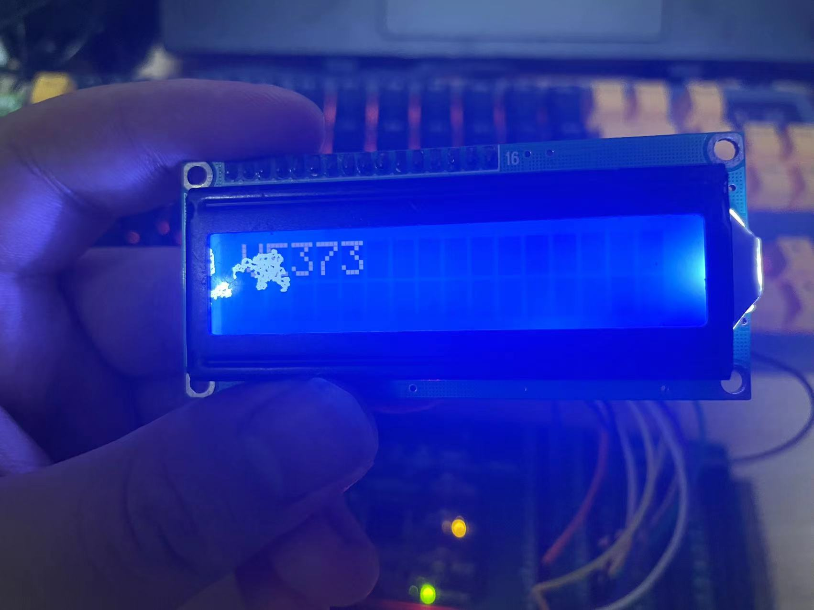
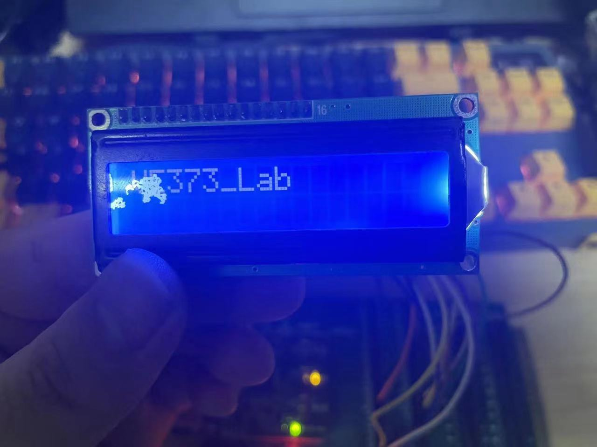
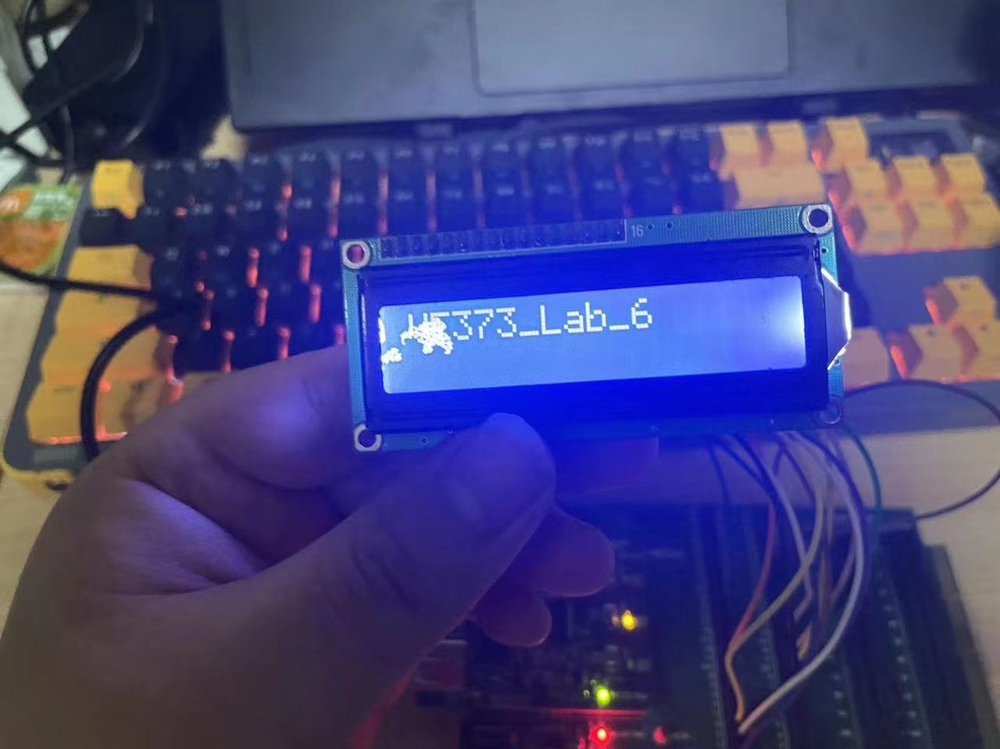

# VE373 Lab 6
Group 5:Qian Dong ，Yifan Hu ， Yinchen Ni, Jeffery Ma.
## Target of this Lab

This lab project aims to establish a serial communication channel  between two PIC32 MCUs using UART modules. The objective is to configure one of the UART modules as a full-duplex transmitter and receiver,  connecting the UxRX and UxTX ports. The system should transmit and  receive only one character, with the received character displayed on the connected LCD, and the transmission controlled by a push button on the  PIC32 board or an external I/O expansion board.

## Source Code  

lab6.c
```c
#include <p32xxxx.h>
#include "LCD.h"

#define readD PORTDbits.RD13

char message = '6';
int displayed = 1;

#pragma interrupt UART_receive ipl6 vector 24
void UART_receive(void) {
    // receive a character
    IEC0bits.U1RXIE = 0;
    IEC0bits.U1ARXIE = 0;
    LATDbits.LATD2 = 1;
    uchar rx;
    while (U1STAbits.URXDA) {
        rx = U1RXREG;
    }
    LCD_put(rx);
    
    IFS0bits.U1RXIF = 0;
    LATDbits.LATD2 = 0;
    IEC0bits.U1RXIE = 1;
    IEC0bits.U1ARXIE = 1;
}


#pragma interrupt CN_ISR ipl5 vector 26
void CN_ISR (void) {
	
	IEC1bits.CNIE = 0;
    readD;
    UART_send();
    // int n;
    
    LATDbits.LATD1 = 1 - LATDbits.LATD1;
    // for (n = 0; n<3000; n++);
    
	IFS1bits.CNIF = 0;
	IEC1bits.CNIE = 1;
}
void CN_init(void){
	asm("di");
	CNCON = 0x8000;
	CNENbits.CNEN19 = 1; //CN19/RD13 as input
	CNPUEbits.CNPUE19 = 1;
    readD;
	IPC6SET = 0x00140000; //Set priority level = 5
	IPC6SET = 0x00030000; //Set subpriority level = 3
	IFS1CLR = 0x0001; //Clear interrupt flag
	IEC1SET = 0x0001;
	asm("ei");
}


void MCU_init() {
    /* setup I/O ports to connect to the LCD module */
    // let A,B,D,E all to be output
    TRISD = 0xFFF0;
    PORTD = 0;
    TRISECLR = 0xFFFF;
    TRISACLR = 0xFFFF;
    TRISBCLR = 0xFFFF;

    /* setup Timer to count for 1 us and 1 ms */
    SYSKEY = 0x0;               // Ensure OSCCON is lock
    SYSKEY = 0xAA996655;        // Unlock sequence part 1 of 2 back to back instructions.
    SYSKEY = 0x556699AA;        // Unlock sequence part 2 of 2 back to back instructions.
    OSCCONbits.NOSC = 0x0007;   // Write new osc src value to NOSC control bits -- FRS, with original freqeuncy as 8 MHz
    OSCCONbits.FRCDIV = 0x2; // the prescale of FRC is 8
    OSCCONbits.PBDIV = 0x0;    // PBCLK is SYSCLK divided by 1. {(Not changed here)Clock is multiplied by 15. PLL output is divided by 1} -- PBCLK has freqeuncy 1 MHz
    OSCCONbits.OSWEN = 0x0001;  // Initiate clock switch by setting OSWEN bit.
    SYSKEY = 0x0;               // Write non-key value to perform a re-lock.

    while(OSCCONbits.OSWEN);    // Loop until OSWEN = 0. Value of 0 indicates osc switch is complete.

    /* Configure Timer interrupts */ 
    INTCONbits.MVEC = 1;        // multi-vector mode
    IPC2SET = 0x000d;           // timer 2: priority is 3, subpriority is 1
    IFS0CLR = 0x0110;           // clear the flags for timer 1 and timer 2
    
    /* enable global and individual interrupts */
    asm( "ei" );                // enable interrupt globally
    LATDbits.LATD2 = 1;
    IEC0SET = 0x0110;           // enable interrupt for timer 1 and timer 2
}

void UART_init(void) {
    asm("di");
    
    // The configuration will override PORTx config

    // Setup for UART Transmit
    U1MODEbits.BRGH = 0; // low speed
    U1BRG = 51; // baud rate: PBCLK / 16
    // The most common data format is 8,N,1 
    U1MODEbits.PDSEL = 0b00; // 8-bit data, no parity (means check)
    U1MODEbits.STSEL = 0; // 1-bit stop bit
    U1MODEbits.UEN = 0b00; // flow control not used
    // no inter-transmit interrupted are needed, skip
    U1STAbits.UTXEN = 1; // transimitter enabled, IF cleared
    IFS0bits.U1ATXIF = 0; // IF clear

    // config the UART Recieve
    // baud rate, stop bit are already configed;
    IFS0bits.U1ARXIF = 0;
    IEC0bits.U1ARXIE = 1; // set receive interrupt
    IEC0bits.U1RXIE = 1; // set receive interrupt
    IFS0bits.U1RXIF = 0;
    IPC6bits.U1AIP = 6; // set ipl6
    IPC6bits.U1AIS = 0b11; // sub priority 3
    U1STAbits.URXEN = 1; // reciver enabled 

    U1MODEbits.ON = 0; // reset then enable
    U1MODEbits.ON = 1;

    asm("ei");
}

void UART_send(void) {
    // start the transimission
    static int idx = 0;
    static char str_test[12] = "VE373_Lab_6";
    if (idx == 11){
        idx = 0;
        LCD_init();
        DelayMsec(40);
    }
    LATDbits.LATD0 = 1;
    while (U1STAbits.TRMT!=1) {
        ; //wait!!!if MCU is sending data
    }
    U1TXREG = str_test[idx];
    while (U1STAbits.TRMT!=1);
    LATDbits.LATD0 = 0;
    idx++;
}


int main() {
    MCU_init();
    UART_init();
    LCD_init();
    CN_init();
    
    LATDbits.LATD2 = 0;
    while (1) ;
    return 0;
}
```

LCD.c

```c
/************************************************************************
* LCD.c
************************************************************************/
#include "LCD.h"

/* main driver */

/* initialize the LCD module */
void LCD_init() {
    DelayMsec(16);      //wait for 16 ms(over 15ms)
    RS = 0;             //send command
    E = 1;
    Data = LCD_IDLE;    //function set - 8 bit interface
    E = 0;
    DelayMsec(5);       //wait for 5 ms
    E = 1;
    Data = LCD_IDLE;    //function set - 8 bit interface
    E = 0;
    DelayUsec(200);     //wait for 200 us(over 100us)
    E = 1;
    Data = LCD_IDLE;    //function set
    E = 0;
    DelayMsec(5);
    E = 1;
    Data = 0b00100000; //function set - 4 bit interface
    E = 0;
    LCD_putchar(LCD_2_LINE_4_BITS);
    DelayMsec(100);
    LCD_putchar(LCD_DSP_CSR);
    DelayUsec(40);
    LCD_putchar(LCD_CLR_DSP);
    DelayMsec(5);
    LCD_putchar(LCD_CSR_INC);
    LATDbits.LATD1 = 1;
}

/* Send one byte c (instruction or data) to the LCD */
void LCD_putchar(uchar c) {
    E = 1;
    Data = c;   //sending higher nibble
    E = 0;      //producing falling edge on E
    E = 1;
    Data <<= 4; //sending lower nibble through higher 4 ports
    E = 0;      //producing falling edge on E
}

/* Display a string of characters *s by continuously calling LCD_putchar() */
void LCD_puts(const uchar *s, int length) {
    // ...your code goes here
    // ...NOTE: must wait for at least 40 us after sending each character to
        // the LCD module.
    RS = 1;
    int i;
    for (i = 0; i < length; i++) {
        LCD_putchar(s[i]);
        DelayMsec(30);
    }
    RS = 0;
}

void LCD_put(const uchar c) {
    static word_count = 0;
    RS = 1;
    LCD_putchar(c);
    DelayMsec(30);
    RS = 0;
    word_count++;
    if (word_count==16) {
        LCD_init();
        word_count = 0;
    }
}

/* go to a specific DDRAM address addr */
void LCD_goto(uchar addr) {
    // ...send an address to the LCD
    // ...NOTE: must wait for at least 40 us after the address is sent
    // TODO;
    RS = 0;
    E = 1; Data = 0x80 + addr; E = 0;
    E = 1; Data <<=4;          E = 0;
    DelayUsec(40);
}

/* configure timer SFRs to generate num us delay*/
void DelayUsec(uchar num) {
    // ...your code goes here
    int i;
    for (i=0; i < 15; i++);
    // PR2 = num;
    // flags.timer2_done = 0;
    // T2CONSET = 0x8000;              // turn on the timer 2
    // TMR2 = 0x0;                     // reset the timer 2
    // while ( ! flags.timer2_done );  // loop until flag 04 (for timer 1) is set
    // flags.timer2_done = 0;          // reset the flags
    // T2CONCLR = 0x8000;                    // turn off timer 
}

/* configure timer SFRs to generate 1 ms delay*/
void GenMsec() {
    // ...your code goes here
    DelayUsec(250);
    DelayUsec(250);
    DelayUsec(250);
    DelayUsec(250);
}

/* Call GenMsec() num times to generate num ms delay*/
void DelayMsec(uchar num) {
    int i;
    for (i=0; i < 15000; i++);
    // uchar i;
    // for (i=0; i<num; i++) {
    //    GenMsec();
    //}
}

/* timer 1 interrupt handler */ 
#pragma interrupt timer_2_interrupt ipl4 vector 8
void timer_2_interrupt(void) {
    T2CONCLR = 0x8000;                // turn off the timer 2
    IFS0CLR = 0x0110;           // clear the flag for timer 2
    flags.timer2_done = 1;      // set up the flags
    TMR2 = 0;
}

/*************end of LCD.c**************/

```

LCD.h

```c
/************************************************************************
* LCD.h
* Header file for the LCD Driver
************************************************************************/
#include <p32xxxx.h>

#ifndef LCD_H
#define LCD_H
/* define macros for LCD instructions */
#define LCD_IDLE 0x33
#define LCD_2_LINE_4_BITS 0x28
#define LCD_2_LINE_8_BITS 0x38
#define LCD_DSP_CSR 0x0c 
#define LCD_CLR_DSP 0x01
#define LCD_CSR_INC 0x06
#define LCD_SFT_MOV 0x14

// * define macros for interfacing ports
#define RS      PORTDbits.RD0
#define E       PORTDbits.RD1
#define Data    PORTE

typedef unsigned char uchar;

struct bits {
    unsigned timer2_done : 1;
//    ...other user defined flags may go here
} flags;


/* Function prototypes */
void MCU_init(void);
void LCD_init(void);
void LCD_putchar(uchar c);
void LCD_puts(const uchar *s, int length);
void LCD_goto(uchar addr);
void GenMsec(void);
void DelayUsec(uchar num);
void DelayMsec(uchar num);

/*****************end of LCD.h**********************/

#endif
```

## Experiment Result







## Result Analysis and discussion

 The system is designed to transmit and receive a single character, with the received character being displayed on an LCD and the transmission controlled by a push button on the PIC32 board or an external I/O expansion board. 